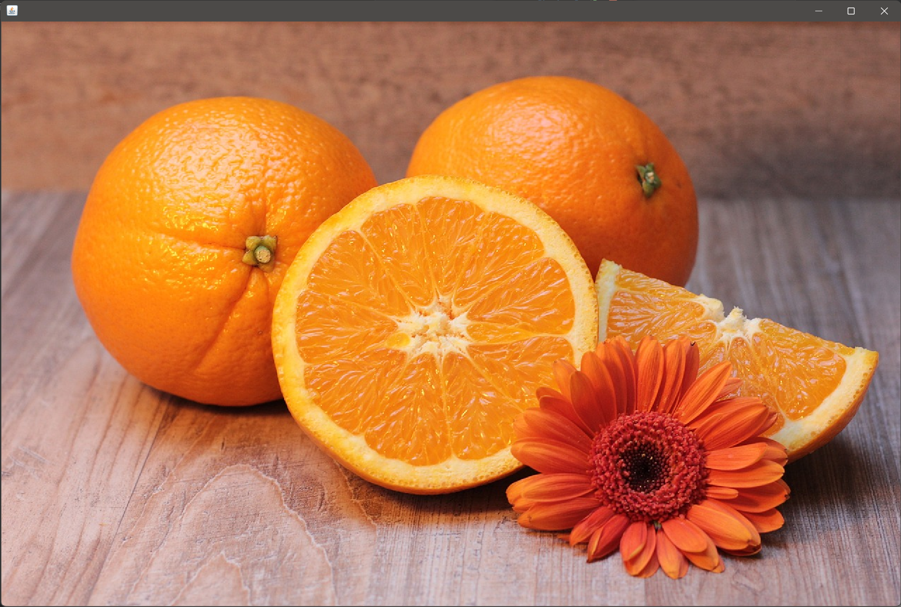
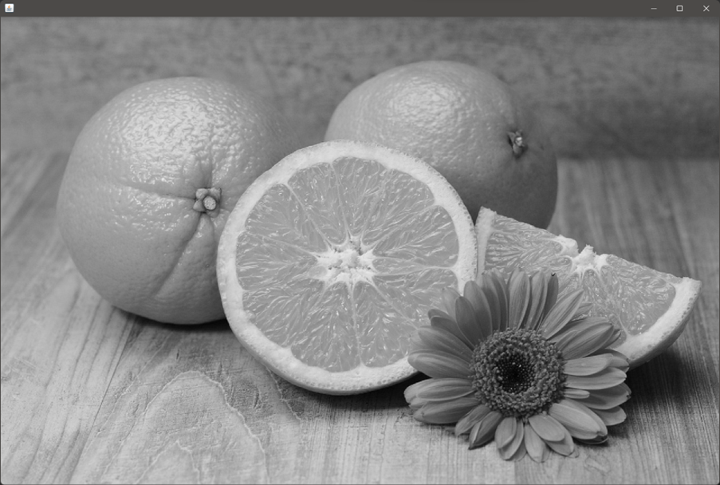
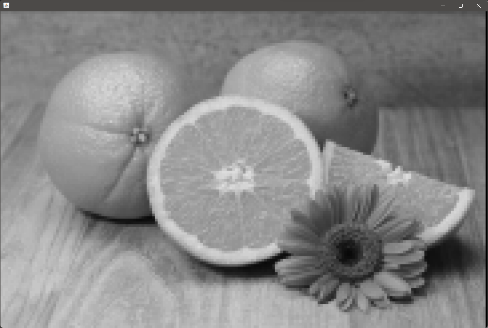
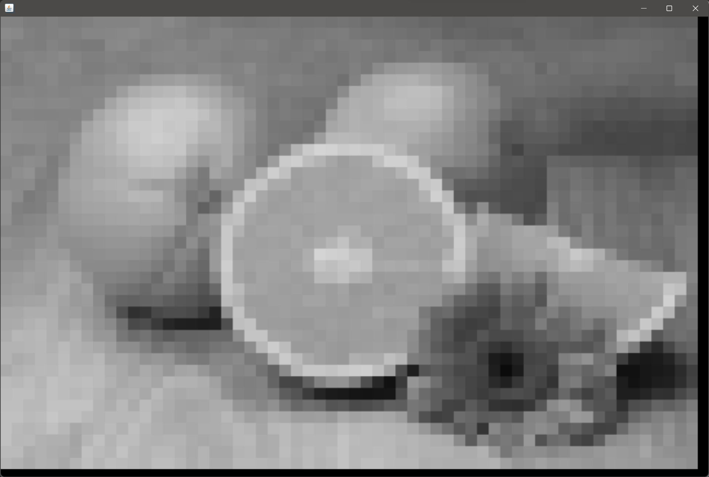
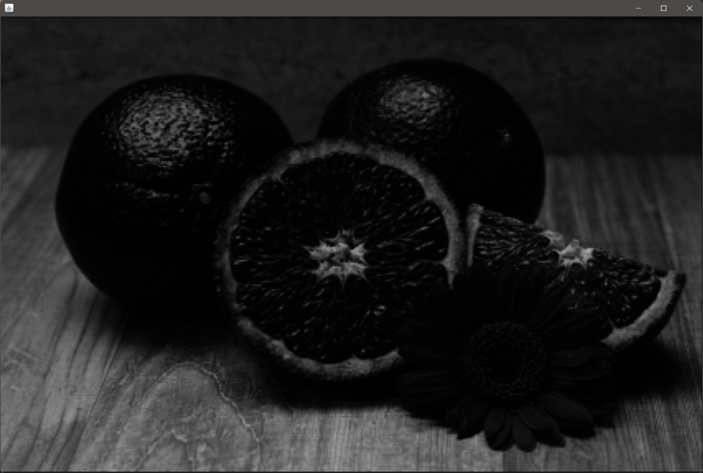
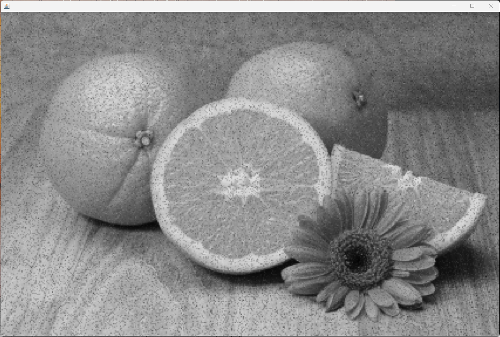
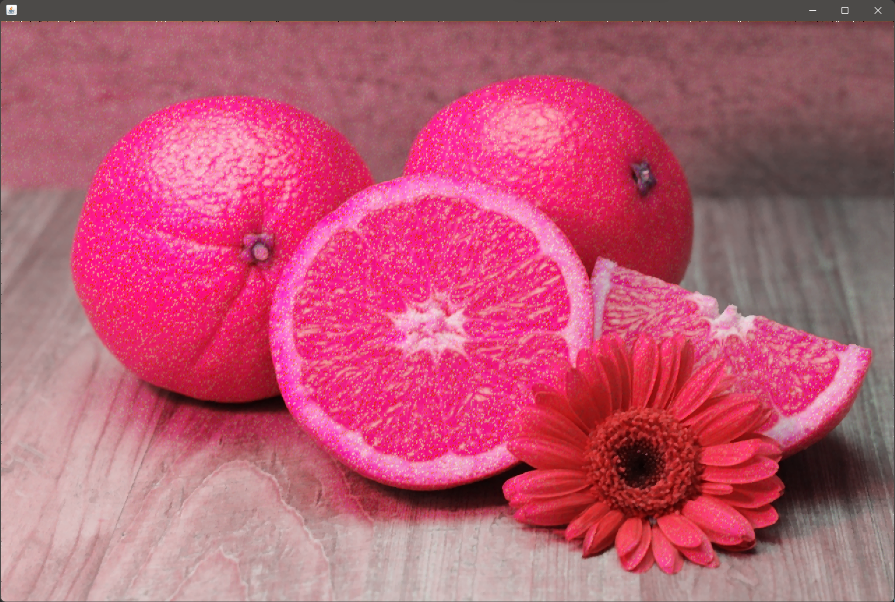
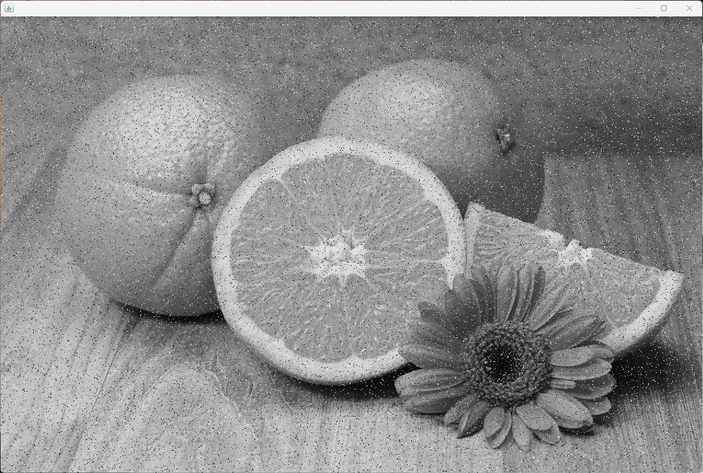

# Image Filters

## Gaussian Filter

### code

code link: [GaussianFilter](https://github.com/joeyajames/Java/blob/master/Image%20Filters/ImageFilter.java)

```java
import java.util.*;
import java.awt.*;
import java.awt.image.*;
import java.io.*;
import javax.imageio.ImageIO;
import javax.swing.*;
import java.awt.geom.AffineTransform;

public class ImageFilterGaussian {

	public static void main(String[] args) {
        String path = "C:\\Users\\solso\\Pictures\\oranges.jpg";
		File file = new File(path);
		//File file = new File("License Plate Photos/ca_10.jpeg");
		BufferedImage img = null;

		try { img = ImageIO.read(file); } 
		catch (IOException e) { e.printStackTrace(System.out); }

		if (img != null) {
			display(img);
			//img = brighten(img);
			img = toGrayScale(img);
			//img = toGrayScale2(img);
			display(img);
			//img = pixelate(img);
			img = pixelate2(img, 3);
			//img = resize(img, 150);
			img = blur(img);
			//img = blur(blur(img));
			//img = heavyblur(img);
			//img = detectEdges(img);
			display(img);
		}
	}

	// display image in a JPanel popup
	public static void display (BufferedImage img) {
		System.out.println("  Displaying image.");
		JFrame frame = new JFrame();
	    JLabel label = new JLabel();
		frame.setSize(img.getWidth(), img.getHeight());
		label.setIcon(new ImageIcon(img));
		frame.getContentPane().add(label, BorderLayout.CENTER);
		frame.setDefaultCloseOperation(WindowConstants.EXIT_ON_CLOSE);
		frame.pack();
		frame.setVisible(true);
	}

	// convert image to grayscale
	public static BufferedImage toGrayScale (BufferedImage img) {
		System.out.println("  Converting to GrayScale.");
		BufferedImage grayImage = new BufferedImage(
			img.getWidth(), img.getHeight(), BufferedImage.TYPE_BYTE_GRAY);
		Graphics g = grayImage.getGraphics();
		g.drawImage(img, 0, 0, null);
		g.dispose();
		return grayImage;
	}

	public static BufferedImage toGrayScale2 (BufferedImage img) {
		System.out.println("  Converting to GrayScale2.");
		BufferedImage grayImage = new BufferedImage(
			img.getWidth(), img.getHeight(), BufferedImage.TYPE_BYTE_GRAY);
		int rgb=0, r=0, g=0, b=0;
		for (int y=0; y> 16) & 0xFF);
				g = ((rgb >> 8) & 0xFF);
				b = (rgb & 0xFF);
				rgb = (int)((r+g+b)/3);
				//rgb = (int)(0.299 * r + 0.587 * g + 0.114 * b);
				rgb = (255<<24) | (rgb<<16) | (rgb<<8) | rgb;
				grayImage.setRGB(x,y,rgb);
			}
		}
		return grayImage;
	}

	// apply 2x2 pixelation to a grayscale image
	public static BufferedImage pixelate (BufferedImage img) {
		BufferedImage pixImg = new BufferedImage(
			img.getWidth(), img.getHeight(), BufferedImage.TYPE_BYTE_GRAY);
		int pix = 0, p=0;
		for (int y=0; y<img.getHeight()-2; y+=2) {
			for (int x=0; x<img.getWidth()-2; x+=2) {
				pix = (int)((img.getRGB(x, y)& 0xFF)
				+ (img.getRGB(x+1, y)& 0xFF)
				+ (img.getRGB(x, y+1)& 0xFF)
				+ (img.getRGB(x+1, y+1)& 0xFF))/4;
				p = (255<<24) | (pix<<16) | (pix<<8) | pix; 
				pixImg.setRGB(x,y,p);
				pixImg.setRGB(x+1,y,p);
				pixImg.setRGB(x,y+1,p);
				pixImg.setRGB(x+1,y+1,p);
			}
		}
		return pixImg;
	}

	// apply nxn pixelation to a grayscale image
	public static BufferedImage pixelate2 (BufferedImage img, int n) {
		BufferedImage pixImg = new BufferedImage(
			img.getWidth(), img.getHeight(), BufferedImage.TYPE_BYTE_GRAY);
		int pix = 0, p=0;
		for (int y=0; y<img.getHeight()-n; y+=n) {
			for (int x=0; x threshold)
					p = (255<<24) | (255<<16) | (255<<8) | 255;
				else 
					p = (255<<24) | (0<<16) | (0<<8) | 0; 
				edgeImg.setRGB(x,y,p);
			}
		}
		return edgeImg;
	}

	// brighten color image by a percentage 
	public static BufferedImage brighten (BufferedImage img, int percentage) {
		int r=0, g=0, b=0, rgb=0, p=0;
		int amount = (int)(percentage * 255 / 100); // rgb scale is 0-255, so 255 is 100%
		BufferedImage newImage = new BufferedImage(
			img.getWidth(), img.getHeight(), BufferedImage.TYPE_INT_ARGB);
		for (int y=0; y> 16) & 0xFF) + amount;
				g = ((rgb >> 8) & 0xFF) + amount;
				b = (rgb & 0xFF) + amount;
				if (r>255) r=255;
				if (g>255) g=255;
				if (b>255) b=255;
				p = (255<<24) | (r<<16) | (g<<8) | b;
				newImage.setRGB(x,y,p);
			}
		}
		return newImage;
	}
}
```

### outputs

original image


gray scale image


gaussian filtered (grayscale, kernel 3)


gaussian filtered (grayscale, kernel 7)


gaussian filtered (grayscale, kernel 21)


gaussian filtered (colored, kernel 3)


gaussian filtered (salt and pepper noise, kernel 3)


***

## Median Filter

### code

code link: [MedianFilter](https://github.com/praserocking/MedianFilter/blob/master/MedianFilter.java)

```java
import java.awt.Color;
import java.awt.image.BufferedImage;
import java.io.*;
import java.util.Arrays;
import javax.imageio.*;
/*
 * Author: Shenbaga Prasanna,IT,SASTRA University;
 * Program: Median Filter To Reduce Noice in Image
 * Date: 9/7/2013
 * Logic: Captures the colour of 8 pixels around the target pixel.Including the target pixel there will be 9 pixels.
 *        Isolate the R,G,B values of each pixels and put them in an array.Sort the arrays.Get the Middle value of the array
 *        Which will be the Median of the color values in those 9 pixels.Set the color to the Target pixel and move on!
 */
public class ImageFilterMedian{
    public static void main(String[] a)throws Throwable{
        String path = "C:\\Users\\solso\\Pictures\\saltandpepper_tiger.png";
        File f=new File(path);                               //Input Photo File
        Color[] pixel=new Color[9];
        int[] R=new int[9];
        int[] B=new int[9];
        int[] G=new int[9];
        File output=new File("MedianOutput.jpg");
        BufferedImage img=ImageIO.read(f);
        for(int i=1;i<img.getWidth()-1;i++)
            for(int j=1;j<img.getHeight()-1;j++)
            {
               pixel[0]=new Color(img.getRGB(i-1,j-1));
               pixel[1]=new Color(img.getRGB(i-1,j));
               pixel[2]=new Color(img.getRGB(i-1,j+1));
               pixel[3]=new Color(img.getRGB(i,j+1));
               pixel[4]=new Color(img.getRGB(i+1,j+1));
               pixel[5]=new Color(img.getRGB(i+1,j));
               pixel[6]=new Color(img.getRGB(i+1,j-1));
               pixel[7]=new Color(img.getRGB(i,j-1));
               pixel[8]=new Color(img.getRGB(i,j));
               for(int k=0;k<9;k++){
                   R[k]=pixel[k].getRed();
                   B[k]=pixel[k].getBlue();
                   G[k]=pixel[k].getGreen();
               }
               Arrays.sort(R);
               Arrays.sort(G);
               Arrays.sort(B);
               img.setRGB(i,j,new Color(R[4],B[4],G[4]).getRGB());
            }
        ImageIO.write(img,"jpg",output);
    }
}
```

### adding salt and pepper noise to image

code link: [salt and pepper](https://github.com/K4m0/Salt-and-Pepper-Noise/blob/master/Main.java)

```java

import java.nio.file.Path;
import java.nio.file.Paths;
import java.util.Random;

import javax.imageio.ImageIO;

import java.awt.Color;
import java.awt.image.BufferedImage;
import java.awt.image.DataBufferByte;
import java.awt.image.Raster;
import java.io.File;
import java.io.IOException;
@SuppressWarnings("unused")
public class Main  {
	
	static BufferedImage image2;
	 static File f = null;
	public static void main(String[] args) {
		try
		{
			//Se carga la imagen
			BufferedImage image1 = ImageIO.read(new File("/Homero.jpg"));
			int width = image1.getWidth();
			int height = image1.getHeight();
			
			//Se convierte a Blanco y Negro
			for(int i=0; i<height; i++){
		         
	            for(int j=0; j<width; j++){
	            
	               Color c = new Color(image1.getRGB(j, i));
	               int red = (int)(c.getRed() * 0.299);
	               int green = (int)(c.getGreen() * 0.587);
	               int blue = (int)(c.getBlue() *0.114);
	               int rgb = range(red+green+blue,8);
	               Color newColor = new Color(rgb,rgb,rgb);
	               
	               image1.setRGB(j,i,newColor.getRGB());
	            }
	         }
			
			try{
			      f = new File("/saved.jpg");
			      ImageIO.write(image1, "jpg", f);
			    }catch(IOException e){
			      System.out.println(e);
			    }

		}
		catch(IOException e)
		{
			System.out.print("No");
		}		
		
	}
	
	public static int range(int n, double prob) {
		double res = ((100 * prob)/10);
		
		int[]array = new int[(int)res];
		array[0]= 1;
		array[1]=255;
		
		for (int i = 2 ; i <= res - 2; i++)
		{
			array[i] = n;
		}
	    int rnd = new Random().nextInt(array.length);
	    return array[rnd];
	}
	
}

	

```

### output

original image


salt and pepper noised (color)


median filtered (color)


salt and pepper noised (gray scale)


median filtered (gray scale)

